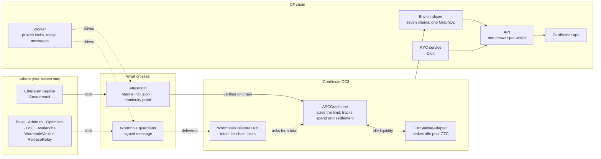
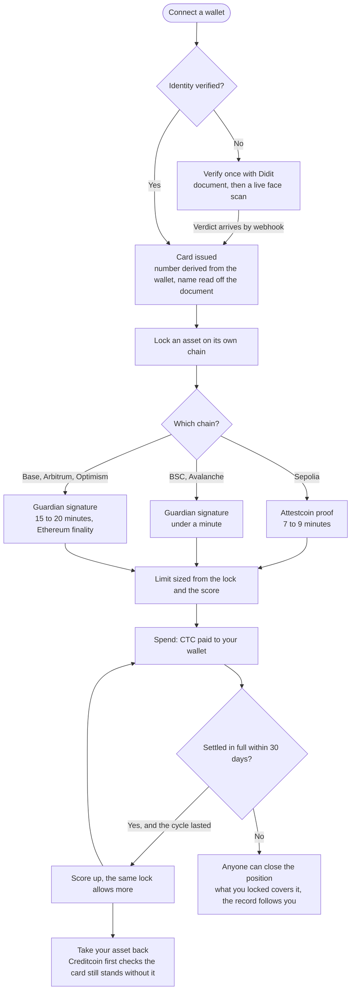
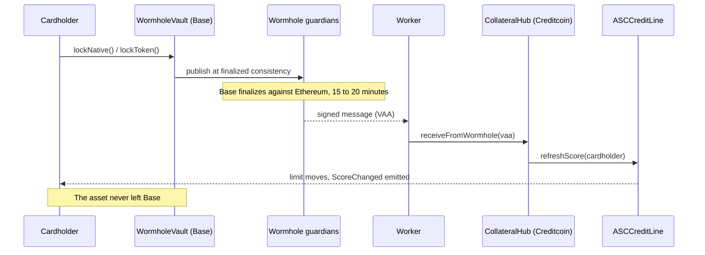

# Comacard

**A debit card whose limit is earned, not deposited.**

Lock what you already hold, on the chain it already sits on. It never moves. The card is
sized against it, you spend, you settle within thirty days, and every cycle you settle on time
lets the same lock allow more. Built on [Creditcoin](https://creditcoin.org) with the
[Attestcoin Protocol](https://docs.attestcoin.org).

| | |
| --- | --- |
| **Try it** | **[app.comacard.xyz](https://app.comacard.xyz)** |
| Docs | [docs.comacard.xyz](https://docs.comacard.xyz) |
| About | [comacard.xyz](https://comacard.xyz) |
| Code | [github.com/comacard/comacard](https://github.com/comacard/comacard) |
| Demo video | [youtu.be/WRNg9Ygko5A](https://youtu.be/WRNg9Ygko5A) |

**Everything here runs on public testnets.** Every contract, every service and every figure in
the app is live, and none of it touches real money. Bring a wallet with testnet funds; the faucets
for every supported chain are in the app under Account.

---

## The problem

Every crypto card today works the same way. You send money in, the card lets you spend exactly
that money, and when it runs out you sell more coins to top it up. Two things are wrong with that.

- **You have to sell to spend.** The coin you were holding for the long run becomes the coin you
  swapped for groceries.
- **Nothing you do counts.** Years of a wallet, every payment on time, and the card still treats
  you as a stranger. A prepaid balance has no memory.

## The solution

Comacard turns what you already hold into a card without moving it.

1. **Lock it where it is.** ETH, USDC, USDT, BNB or AVAX goes into a vault on its own chain. It is
   not bridged, not wrapped, and never in our custody.
2. **Creditcoin sees a proof, not a promise.** A cryptographic proof of that lock crosses to
   Creditcoin, which sizes the card against it. Nothing is credited on the word of a server.
3. **Spend, then settle.** The card pays out CTC on Creditcoin. You settle the amount within
   thirty days. No interest, no fee.
4. **Your record grows the card.** A cycle settled in full raises your score, and the score raises
   how much the same lock allows: from two thirds of what you locked at the start, to more than you
   locked once the record is clean. Settle late, and the position is closed against what you
   locked, and the record follows you.

The score is built from behaviour, never from net worth, because the protocol underneath can only
prove that transactions happened. That constraint is what makes this a card with a memory rather
than a wallet with a plastic front.

## How it works



Two carriers, deliberately unequal. Attestcoin reaches Ethereum Sepolia and Ethereum Mainnet and
nothing else, so the other five chains arrive through the one Wormhole component Creditcoin
actually has, the Core Contract. No token bridge, no relayer, no wrapped asset: the deposit stays
in a vault on its own chain and only the message crosses, which is the same promise the Attestcoin
path makes. The credit line never learns about a second chain; it asks the hub for a total.

### A cardholder's journey



### A far-chain deposit, step by step



## The numbers behind the limit

The limit is arithmetic, not a black box. Every unit you can spend needs this much locked, by score:

| Score | Locked per unit of spend | On 10 CTC of collateral |
| --- | --- | --- |
| 0 | 150% | 6.67 CTC |
| 42 | 120.6% | 8.29 CTC |
| 100 | 80% | 12.5 CTC |

- A cycle only counts if it **lasted**: a draw settled inside `minCycleDuration` (60 seconds on
  the testnet deployment) earns nothing, otherwise ten cycles in one block would buy a spotless
  record for the price of gas.
- Only a settlement that clears the balance **to zero** closes a cycle. Partial payments reduce
  what is owed and earn no mark.
- History alone caps out at 40 points. A busy Ethereum wallet that has never settled anything here
  is still a stranger.

## Live on testnet

Every address below is deployed, verified and in use. The numbers in the app come off these
contracts, not out of a mock.

**Ethereum Sepolia**, where collateral is locked and stays

| | |
| --- | --- |
| SourceVault | [`0x911290c3…3303`](https://sepolia.etherscan.io/address/0x911290c37E9558C704870f4C44CBdEA1B2B33303) |

**Creditcoin CC3 testnet** (chain `102031`), where the card lives

| | |
| --- | --- |
| ASCCreditLine | [`0x18052272…E906`](https://creditcoin-testnet.blockscout.com/address/0x18052272cC69113DE2b45d2BDB4E1fB287F4E906) |
| CtcStakingAdapter | [`0xA94218Db…7045`](https://creditcoin-testnet.blockscout.com/address/0xA94218Dbdb142A10e32eF7b494105D27F47f7045) |
| WormholeCollateralHub | [`0x9D77f5E1…437f`](https://creditcoin-testnet.blockscout.com/address/0x9D77f5E1D5Afe5258cA16F808DC5BA1E9F68437f) |

**Five more chains**, collateral Attestcoin cannot reach, carried by Wormhole

| | |
| --- | --- |
| Base Sepolia | [`0x7439dff6…6Daf`](https://sepolia.basescan.org/address/0x7439dff6270C2B52B00B7Fc5CA94c56d5b166Daf) |
| Arbitrum Sepolia | [`0x029ae4ff…7F30`](https://sepolia.arbiscan.io/address/0x029ae4fffE7DBD8dF7450E12d25a840A818f7F30) |
| Optimism Sepolia | [`0xCaBFa324…3e0B`](https://sepolia-optimism.etherscan.io/address/0xCaBFa324576c655D0276647A7f0aF5e779123e0B) |
| BSC Testnet | [`0x9d8B6852…32d6`](https://testnet.bscscan.com/address/0x9d8B6852705dD7585B3907244d603547a4eA32d6) |
| Avalanche Fuji | [`0x7D68B54a…8a1b`](https://testnet.snowtrace.io/address/0x7D68B54a6eDd92F9e6f17E75dbE4d9838cD88a1b) |

Each accepts its chain's native coin, and the two with a canonical USDC accept that too. All five
have taken a real deposit, and all five give it back without an operator: a `ReleaseRelay` beside
each vault holds the role a person used to, and acts only on a message Creditcoin signed. Adding
another chain is a deploy and two calls.

Both Creditcoin contracts sit behind UUPS proxies; the Sepolia vault does too. All three are
compiled for the London EVM, because CC3 reports `baseFeePerGas` but no `mixHash`.

**Front ends** on Vercel

| | |
| --- | --- |
| App | [app.comacard.xyz](https://app.comacard.xyz) |
| Landing | [comacard.xyz](https://comacard.xyz) |
| Docs | [docs.comacard.xyz](https://docs.comacard.xyz) |

The docs site renders the markdown in this repository rather than a copy of it, so a page there
and the file it came from cannot drift. Each page names its source and links to it.

**Services** on Railway

| | Base URL | Swagger |
| --- | --- | --- |
| API | https://api-production-1141.up.railway.app | [/docs](https://api-production-1141.up.railway.app/docs) |
| KYC | https://kyc-production-e05a.up.railway.app | [/docs](https://kyc-production-e05a.up.railway.app/docs) |
| Worker | no HTTP surface, it polls and submits proofs | |

The worker is a daemon rather than a server, which is why it has no URL.

A front end only ever talks to the API. It is open, has CORS enabled, and is read-only apart from
one call that starts an identity check. Every number is either read off the chain or off the
indexer's copy of it. One call per screen:

| Call | Gives you |
| --- | --- |
| [`GET /account/{wallet}`](https://api-production-1141.up.railway.app/account/0x3b4f0135465d444a5bd06ab90fc59b73916c85f5) | KYC status, live limit / available / drawn, CTC balance, and the card (active, masked number, account number, expiry) |
| `POST /account/{wallet}/kyc` | Starts Didit, returns `{ sessionId, url }`. Send the user to `url` |
| `GET /account/{wallet}/card` | Full card number, CVV, expiry. 404 until KYC is Approved |
| [`GET /account/{wallet}/activity`](https://api-production-1141.up.railway.app/account/0x3b4f0135465d444a5bd06ab90fc59b73916c85f5/activity) | Draws, settlements, collateral locks, defaults. Newest first, with explorer tx hashes |
| [`GET /protocol`](https://api-production-1141.up.railway.app/protocol) | Pool liquidity, CTC staking position, collateral price |

```sh
API=https://api-production-1141.up.railway.app
W=0x3b4f0135465d444a5bd06ab90fc59b73916c85f5     # has a limit on testnet

curl $API/account/$W                     # the card screen in one call
curl -X POST $API/account/$W/kyc         # → { sessionId, url }
curl $API/account/$W/card                # 404 until Approved
curl $API/account/$W/activity
curl $API/protocol
```

`card.active` means KYC cleared and nothing is overdue; `card.spendable` is what
`ASCCreditLine.availableOf` will honour right now, which can be zero. Spending and settling are
wallet transactions against the contract, not API calls.

The API reaches the KYC service over Railway's private network; the KYC service keeps its SQLite
state on a volume at `/data`. Both build from the `Dockerfile` in their own directory with the
repository root as context.

**Indexer**, seven chains behind one GraphQL endpoint, hosted on Envio Cloud

    https://indexer.dev.hyperindex.xyz/8c13372/v1/graphql

Browse it with a schema sidebar and autocomplete, no credentials needed:
[Apollo Sandbox](https://studio.apollographql.com/sandbox/explorer?endpoint=https%3A%2F%2Findexer.dev.hyperindex.xyz%2F8c13372%2Fv1%2Fgraphql)

Sepolia syncs through HyperSync; Creditcoin CC3 and the five Wormhole chains read over plain RPC,
which the same indexer handles without noticing. On the Development plan each deployment gets its
own URL, so this address changes whenever `main` moves. Anything that consumes it reads
`INDEXER_URL` rather than hardcoding it.

## The card

Derived, not stored: `HMAC(CARD_SECRET, wallet)` gives a Luhn-valid number on the private BIN
`9924`, plus an account number and a CVV. Rotating `CARD_SECRET` reissues everyone's card.

It exists the moment identity clears; there is no activation step. The check runs once, through
Didit: a document, then a live face scan. We receive the verdict by webhook and never see the
document itself. The cardholder name is read off that document and never typed, because a typed
name is not the name that was verified. The full number and CVV are returned by exactly one
endpoint, so a list screen never holds them.

## What is real, and what is not

| Layer | Status |
| --- | --- |
| Credit history | Real Ethereum Mainnet transactions (`chainKey 3`) |
| Attestcoin verification | Real, full Merkle plus continuity proofs |
| Collateral vault | Real contract on Sepolia, testnet value |
| Spend and settlement | Real transactions on Creditcoin CC3 testnet |
| Cross-chain deposits | Real Wormhole guardian signatures, finalized consistency |
| Cross-chain withdrawals | Real, and with no operator in the path |
| Identity check | Real Didit verification, document and face |
| Collateral prices | **Operator-fed.** Attestcoin proves transactions, not prices |
| Sepolia collateral release | **Operator-approved.** `approveRelease` is gated on us |
| Staking | **Custodial, pool liquidity only.** Your locked assets are never staked |

Token values are testnet values; the cryptography and the state transitions are not simulated.

The three bold rows are the places this product is not trustless, and the rest of the table is.
Sepolia release is operator-approved because Creditcoin cannot yet write back to Ethereum; the
five Wormhole chains already release without us, which is what the Sepolia path becomes the day
Attestcoin writability ships. Idle pool CTC is staked in Creditcoin's own Proof-of-Stake by an
operator account because there is no staking precompile, and `deployedPrincipal` reports exactly
how much that is.

Wormhole's **testnet guardian set has one member**, so cross-chain messages here carry a single
signature rather than the 13-of-19 the name suggests. The same contracts inherit 13-of-19 against
mainnet. A judge who decodes one of our messages will find that byte in a minute, so we would
rather say it first. [TRUST.md](contracts/TRUST.md) sets out the rest.

## Verified end to end

A full cycle run against the deployed contracts, with every transaction hash:
[docs/e2e-testnet-run.md](docs/e2e-testnet-run.md). Lock 0.0006 ETH, prove it through Attestcoin,
spend, settle in full: the score moved 0 to 42 and the limit moved 0.4 to 0.4975 tCTC on the same
collateral. The arithmetic is worked through there, so a limit that looks wrong can be checked by
hand.

Recording a demo of this: [DEMO.md](DEMO.md). The sequence, the exact commands, and the one timing
constraint that will ruin a take if you meet it live.

## Layout

```
apps/
  api/        HTTP API, composes indexer, KYC and chain per wallet
  kyc/        KYC service, Didit sessions and webhook intake
  app/        Cardholder app: Next.js and wagmi. KYC, spend, settle
  landing/    Marketing site
  docs/       Documentation site, rendering this repository's own markdown
  worker/     The daemon: proves Sepolia locks, relays Wormhole messages
  indexer/    Envio indexer, seven chains behind one GraphQL endpoint
contracts/    Foundry: SourceVault (Sepolia), ASCCreditLine (Creditcoin),
              WormholeVault and ReleaseRelay (everywhere else)
packages/
  attestcoin/ Attestcoin chain constants and proof types
  core/       Domain model: money, attested events, scoring
  tsconfig/   Shared TypeScript configuration
```

## Getting started

Requires [Bun](https://bun.sh) ≥ 1.3 and [Foundry](https://getfoundry.sh).

```sh
bun install
cp .env.example .env      # fill in RPC URLs
bun run test
bun run dev
```

Contracts:

```sh
cd contracts
forge install foundry-rs/forge-std --no-git
forge build && forge test
```

## Notes on the protocol

Facts verified against `@gluwa/asc-contracts@0.2.1` and the Attestcoin docs:

- **Source chains are limited.** CC3 testnet attests Ethereum Sepolia (`chainKey 1`) and Ethereum
  Mainnet (`chainKey 3`). Nothing else, which is why anywhere else arrives by Wormhole.
- **Creditcoin has Wormhole Core and nothing more.** No token bridge, no automatic relayer, so
  fetching a signed message and delivering it is our own job. The vaults publish at finalized
  consistency, and that is not the same wait everywhere: the L1s sign in under a minute, the L2s
  take fifteen to twenty because they finalize against Ethereum.
- **No state reads.** `EvmV1Decoder` exposes transaction fields, receipt fields and logs. There is
  no storage or account proof, so balances and silently accruing yield (Lido rebases, Aave
  `liquidityIndex`) cannot be attested.
- **Writability is not released.** Creditcoin cannot yet send messages back to a source chain, so
  Sepolia collateral release is operator-signed for now.
- **Prove early.** Continuity proofs lengthen as attestations are thinned to checkpoints; a day-old
  transaction costs roughly 10× a fresh one.

## Licence

MIT
